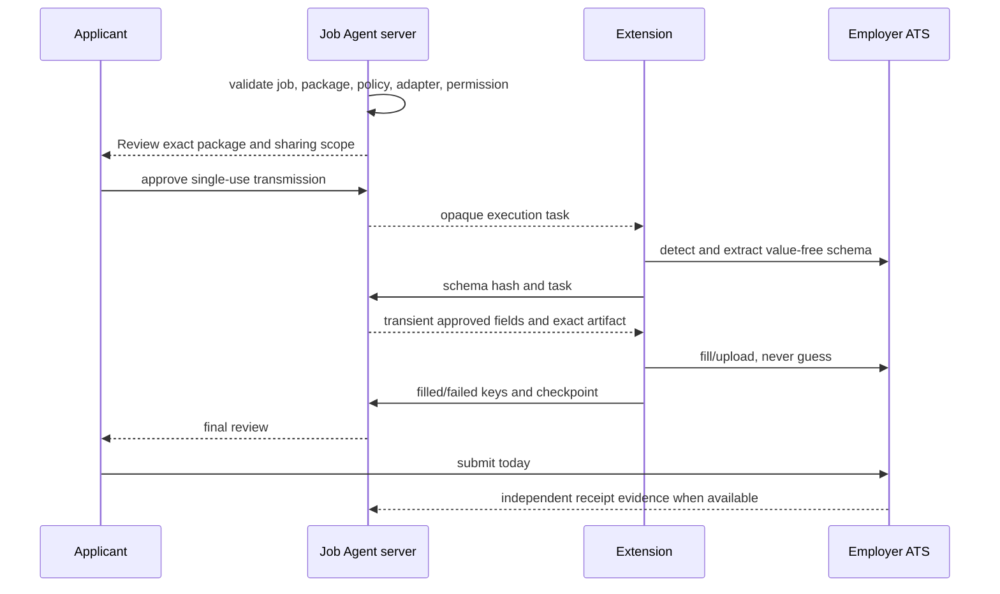

# Chrome extension target architecture

## Target flow

## Design rules

- Keep `activeTab` capture user-triggered and separate from application execution.
- Package only currently supported adapters; exclude dormant legacy scripts.
- Extension contains adapter mechanics, not applicant policy or answer selection.
- Require server/extension protocol version compatibility and an allowlisted artifact digest.
- Store only opaque, short-lived task/capture identifiers and value-free status.
- Never store passwords, cookies copied from the page, OTP/CAPTCHA, applicant profile, resume bytes, or form values.
- A changed employer schema invalidates prior approval.
- A partial or ambiguous result creates one recoverable checkpoint; no automatic repeat.

## Mobile strategy

Mobile approves and monitors tasks. If desktop execution is required, send a privacy-safe “Continue on desktop” instruction and preserve the task. Do not attempt to emulate Chrome extension execution inside a native mobile webview.

## Release gates

1. Version/digest matches store package and server allowlist.
2. Per-adapter conformance/failure suites pass.
3. Controlled live read/fill tests pass with synthetic data and no submission.
4. Content-free adapter metrics and alert thresholds exist.
5. Rollback can disable one adapter/version without disabling capture or Job Agent preparation.
