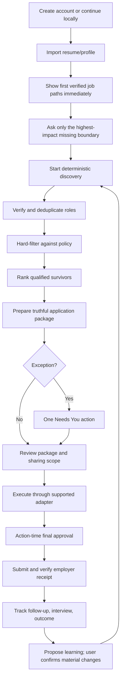

# Ideal user journey

## North-star flow

## Screen model

The primary product should have four user concepts:

1. **Home:** one next action, current progress, and recent outcomes.
2. **My Jobs:** matches, preparing, needs you, submitted, interviews, closed.
3. **Saved Info:** verified facts, preferences, policies, permissions, and provenance.
4. **Agent Status:** whether discovery/preparation is running, paused, or needs recovery.

Resume tools, Career Positioning, LinkedIn optimization, interview practice, and tracker details become contextual actions within those four concepts, not permanent top-level destinations.

## Progressive learning

- Import first; parse facts into a draft Career Profile with source citations.
- Let the user confirm a small high-impact subset: identity/contact, current/recent roles, target path, work location, work authorization, salary floor, relocation/travel, exclusions.
- Show jobs before exhaustive cleanup.
- Ask additional questions only when they block a real qualifying application or materially expand coverage.
- Reuse exact or semantically canonicalized answers only within explicit scope and expiry.

## Human interruption budget

- Target: no more than one interruption per qualified application before final review.
- Batch low-risk confirmations when they share a clear scope.
- Never batch OTP, CAPTCHA, signatures, attestations, sensitive demographic answers, legal acknowledgements, or final submission approval.
- Keep all other jobs moving when one job is blocked.

## Full-autopilot experience

Full Autopilot is exception-based processing within a user-approved policy, not unrestricted clicking. The user still reviews material representations and authorizes final external action until legal, reliability, and receipt coverage justify narrower pre-authorization for explicitly defined low-risk cases.

## Mobile role

Mobile is the control plane: approve packages, answer a blocking question, adjust policy, pause/resume, inspect progress, and receive privacy-safe alerts. Employer form automation remains in desktop browser/server execution; mobile should not reproduce a desktop ATS or the full legacy resume editor.
