# Job Agent state machine

## Canonical application lifecycle

```mermaid
stateDiagram-v2
  [*] --> Discovered
  Discovered --> Verified: employer source current
  Discovered --> Rejected: hard policy or duplicate
  Verified --> Preparing
  Preparing --> NeedsYou: missing fact or failed QA
  NeedsYou --> Preparing: resolved
  Preparing --> PackageReady: truth + artifact + render QA
  PackageReady --> Filling: sharing approval consumed
  Filling --> NeedsYou: sign-in / OTP / CAPTCHA / unsupported field
  Filling --> FinalReview: exact checkpoint preserved
  Filling --> OutcomeUnknown: ambiguous fill result
  OutcomeUnknown --> FinalReview: user verifies fields present
  OutcomeUnknown --> NeedsYou: fields absent; fresh approval required
  FinalReview --> Submitting: final approval consumed
  Submitting --> ReceiptPending: provider reports attempt
  Submitting --> OutcomeUnknown: ambiguous result
  ReceiptPending --> Submitted: authoritative receipt verified
  ReceiptPending --> NeedsYou: receipt cannot be resolved
  Submitted --> Interview
  Submitted --> RejectedClosed
  Submitted --> FollowUpDue
  FollowUpDue --> Submitted: follow-up completed
```

## State rules

- `Prepared`, `PackageReady`, `Filling`, HTTP 2xx, and provider acceptance are never `Submitted`.
- `OutcomeUnknown` is durable and blocks automatic retry.
- Terminal/receipt-backed state cannot move backward silently.
- Pause/revoke stops new claims and external actions but preserves evidence.
- Every transition is version checked, idempotent, append-audited, and tenant scoped.
- Public labels may remain simple while internal substate names remain in the audit record.

## Job Agent run lifecycle

`Searching -> Preparing -> Waiting for You -> Finished`, with parallel `Paused` and `Failed` paths. A run lease is hashed, heartbeated, reclaimable after expiry, and retried only for known transient internal work. This run lifecycle should orchestrate applications but must not replace their more precise state machine.

## Migration mapping

| Legacy label | Canonical import |
| --- | --- |
| saved/new | Discovered, source `legacy_browser_import` |
| tailored | Preparing or PackageReady only after artifact reconciliation |
| applied | NeedsYou: verify outcome; never Submitted automatically |
| interview | Interview with `USER_CONFIRMED` evidence |
| rejected | RejectedClosed with `USER_CONFIRMED` evidence |
| unknown | OutcomeUnknown |
