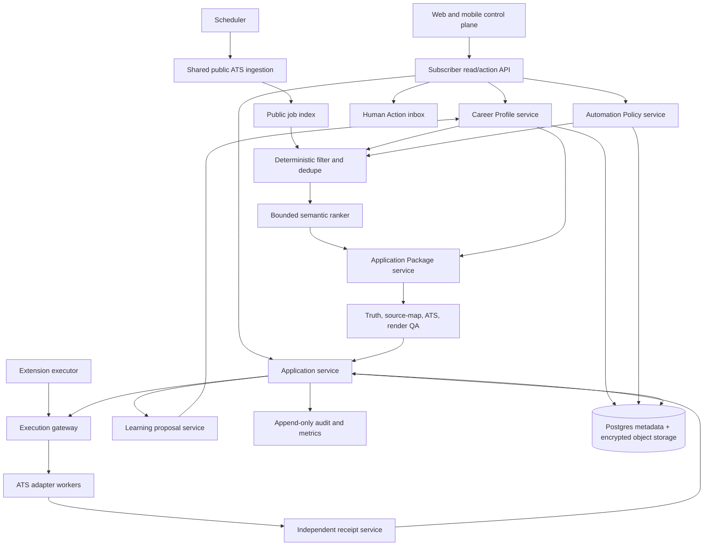

# Target system architecture

## Principle

Build a set of bounded, auditable workflow services coordinated by a Job Agent, not one giant conversational agent. Deterministic code owns identity, policy, state, permissions, retries, receipts, and cost. Models handle bounded semantic work and writing from retrieved verified evidence.

## Bounded services

| Service | Owns | Must not own |
| --- | --- | --- |
| Identity/tenant | account, sessions, tenant scope | applicant prose or ATS logic |
| Career Profile | verified facts, provenance, versions, evidence | generated copy as fact |
| Policy | hard filters, review rules, permissions | probabilistic fit prose |
| Job ingestion | public listings, source evidence, freshness | candidate data |
| Decision engine | deterministic eligibility, dedupe, routing | final external action |
| Semantic ranker | bounded comparison among qualified survivors | policy overrides |
| Package service | resume/letter/answers tied to exact evidence versions | submission state |
| Application service | canonical lifecycle, approvals, checkpoints | raw credentials |
| Execution gateway | single-use tasks, adapter selection, outcomes | reusable business policy |
| Receipt service | authoritative employer evidence | optimistic Submitted labels |
| Human Action inbox | one focused user action with impact | internal queue details |
| Learning service | proposed profile/policy changes | silent mutation of verified facts |

## Data design

- Postgres becomes the durable relational authority for tenants, profiles, facts, preferences, jobs, applications, documents, human actions, policy versions, and audit references.
- Encrypted private object storage holds document bodies and artifacts; Postgres stores versioned metadata/hashes.
- Redis remains queue, lease, rate-limit, idempotency, short-lived execution, and cache infrastructure—not the sole history store.
- A projection API serves simple subscriber status. The UI never reconstructs truth by merging localStorage and multiple stores.
- Shared public job index contains no candidate data. Tenant decisions reference immutable job/source versions.

## Deployment model

1. Keep the existing Vercel app/API while extracting modules.
2. Add continuous bounded workers for ingestion and tenant queues.
3. Keep employer-browser execution isolated with exact host allowlists, ephemeral sessions, denied recording/downloads, and provider-confirmed teardown.
4. Bind deployable artifacts to commit, migration digest, feature flags, extension digest, runtime checks, and rollback target.

## Non-negotiable invariants

- One canonical job identity and one application per tenant/job/policy decision.
- One stable idempotency key per material operation/version.
- Outcome unknown blocks automatic retry.
- Only authoritative employer evidence yields Submitted.
- Every external action requires a current scoped permission.
- Unknown evidence stays unknown.
- Generated language never silently becomes verified fact.
