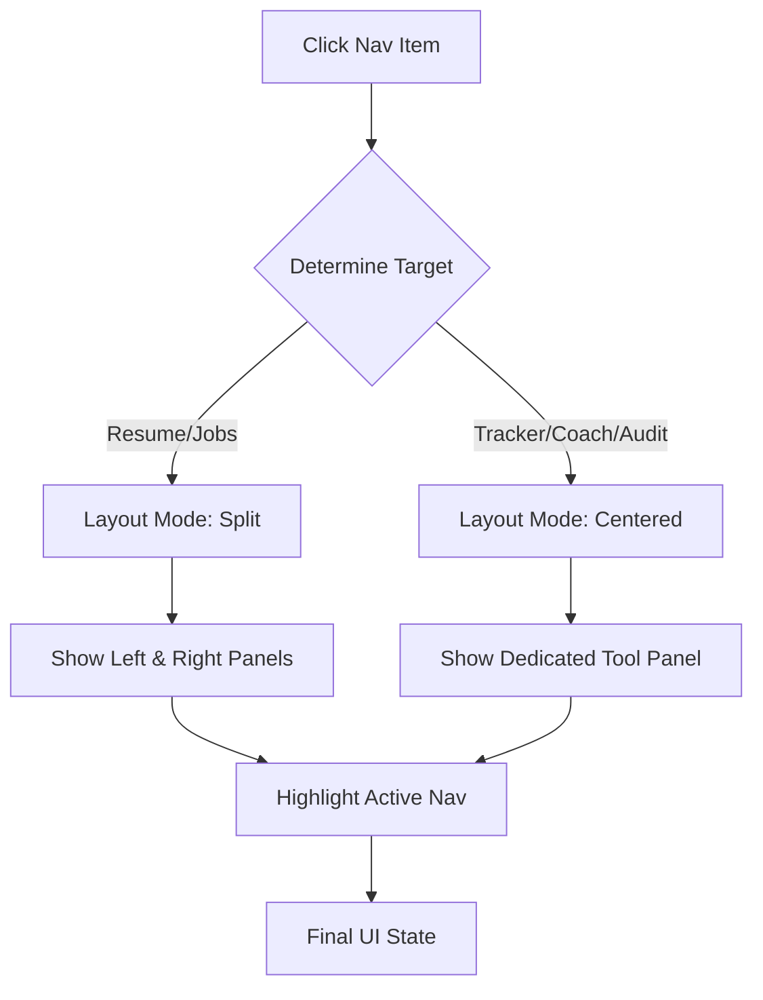

# Interactivity Map — Navigation IDs & Panel Mapping

This map links the navigation UI elements to their respective panels and logic handlers.

| UI Element (ID/Selector) | Action (Click/Hover) | Target Panel / Function | Layout Mode |
| --- | --- | --- | --- |
| `#topNavResume` | Click | `switchMode('resume')` | Split |
| `#topNavJobs` | Click | `switchMode('jobs')` | Split |
| `#sbTracker` | Click | `switchMode('tracker')` | Centered |
| `#sbAiCoach` | Click | `switchMode('aicoach')` | Centered |
| `#sbLinkedIn` | Click | `switchMode('linkedin')` | Centered |
| `#sbProfileAudit` | Click | `switchMode('profile-audit')` | Centered |
| `#sbBulkApply` | Click | `switchMode('bulkapply')` | Centered |
| `#moreDropdown` | Hover | CSS Dropdown visible | N/A |
| `#userProfileTrigger` | Hover | CSS Dropdown visible | N/A |

## Switch Logic Flow (`switchMode`)

## Panel Visibility Selectors:
- **Resume/Jobs**: `#leftPanel`, `#jobSearchLeft`, `#jobSearchRight`.
- **History**: `#tailoredHistoryPanel`.
- **Tracker**: `#trackerPanel`.
- **AI Coach**: `#aicoachPanel`.
- **LinkedIn**: `#linkedInPanel`.
- **Profile Audit**: `#profileAuditPanel`.
- **Bulk Apply**: `#bulkApplyPanel`.
