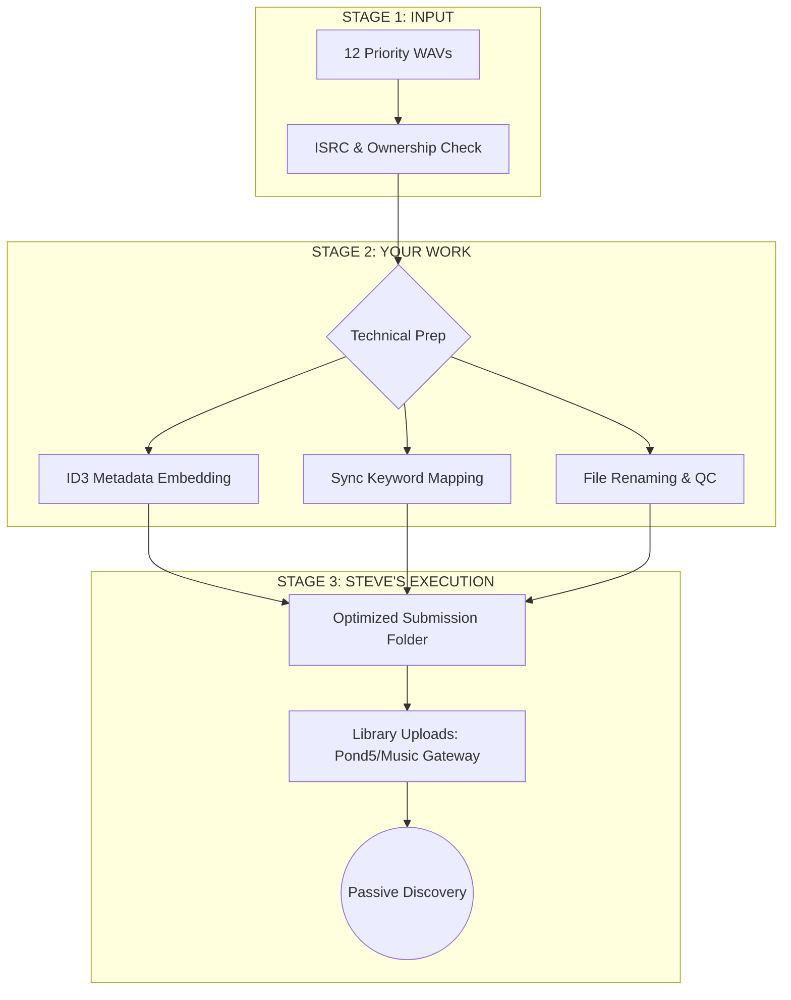

```mermaid
graph TD
    subgraph Raw_Assets [STAGE 1: INPUT]
    A[12 Priority WAVs] --> B[ISRC & Ownership Check]
    end

    subgraph Tech_Optimization [STAGE 2: YOUR WORK]
    B --> C{Technical Prep}
    C --> D[ID3 Metadata Embedding]
    C --> E[Sync Keyword Mapping]
    C --> F[File Renaming & QC]
    end

    subgraph Distribution [STAGE 3: STEVE'S EXECUTION]
    D & E & F --> G[Optimized Submission Folder]
    G --> H[Library Uploads: Pond5/Music Gateway]
    H --> I((Passive Discovery))
    end
```

